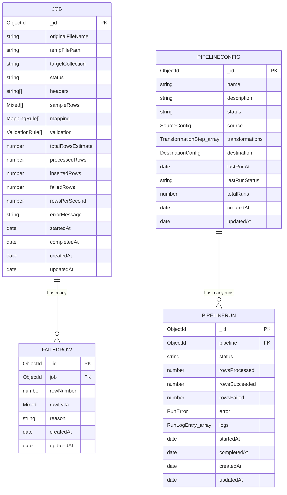

# StreamWeaver — Database Design

**Owner:** Nikhil Singh (Database & Testing)
**Weeks covered:** 1, 2, 3
**Database engine:** MongoDB (via Mongoose ODM)

This document is the running database design doc, updated each week:
1. Project requirements → required collections
2. ER diagram (all collections, current as of Week 3)
3. Full schema definition
4. Indexing strategy
5. How this connects to the backend
6. Sync responsibility (who updates the denormalized counters, and when)

> **Week 1** added `jobs` + `failedrows` (one-shot CSV upload & process).
> **Week 2** added `pipelineconfigs` (saved, reusable pipeline definitions
> for the new Pipeline Builder). **Week 3** added `pipelineruns` (Run
> History — each execution of a saved pipeline). Section 1 below explains
> how the two feature sets relate.

---

## 1. Requirements → Collections

StreamWeaver lets a user upload a huge CSV, map its columns to destination
fields, and stream the cleaned rows into MongoDB in bulk batches. Reading the
project brief and the existing backend code (`src/models/`), the data that
must persist is:

| Data | Why it needs to persist | Collection |
|---|---|---|
| One record per uploaded file / ETL run, its status, its column mapping, and its live counters | The frontend polls/subscribes to this while a job runs, and needs it after the fact for history | **`jobs`** |
| Rows that failed validation during a run, with the reason they failed | The error-handling UI (`GET /api/jobs/:id/errors`) needs to list *why* specific rows were rejected | **`failedrows`** |

Because MongoDB is schemaless, "tables" here means **Mongoose schemas /
collections** with enforced structure at the application layer rather than
rigid SQL tables — that's intentional, since row shapes coming out of the
mapping step vary per job.

> **Note for the team:** no `users` collection exists yet because the backend
> has no authentication layer (see backend README, "Suggested next steps").
> If auth is added later, `jobs` and `pipelineconfigs` should each gain a
> `user` reference field — the schemas below are written so that's a
> one-line addition, not a redesign.

**How Week 1 and Week 2/3 features relate:** `Job`/`FailedRow` is the
original "upload one CSV, process it once, throw the config away" flow.
`PipelineConfig`/`PipelineRun` (Week 2/3) is the newer **Pipeline
Builder**: a Source → Transformation → Destination definition that's
*saved* and can be *run repeatedly*, with every run recorded in
`PipelineRun` (Run History) instead of being a one-off. Both features are
currently kept side by side — flagged to the team at Mid Review to decide
whether `Job` should eventually be folded into a single "one-time run" of
a `PipelineConfig`, or stay separate as a simpler/faster upload path.

---

## 2. ER Diagram

**Relationships:**
- one `Job` → many `FailedRow` documents (`FailedRow.job` refs `Job._id`) — Week 1.
- one `PipelineConfig` → many `PipelineRun` documents (`PipelineRun.pipeline`
  refs `PipelineConfig._id`) — Week 2/3.

Both are one-to-many modeled with **references, not embedding**, for the
same reason: the "many" side (failed rows / run history) is unbounded and
can get large, which would risk hitting MongoDB's 16MB document limit if
embedded inside the parent.

---

## 3. Schema Definition

### 3.1 `jobs` collection (`src/models/Job.model.js`)

| Field | Type | Required | Notes |
|---|---|---|---|
| `originalFileName` | String | ✅ | Name of the uploaded CSV |
| `tempFilePath` | String | ✅ | Where the raw upload streamed to on disk |
| `targetCollection` | String | ✅ | Dynamic destination collection for cleaned output |
| `status` | String (enum) | — | `uploaded → mapped → processing → completed / failed` |
| `headers` | [String] | — | Detected CSV column headers |
| `sampleRows` | [Mixed] | — | First N rows, used for the mapping-UI preview |
| `mapping` | [MappingRule] | — | Sub-doc: `{ source, destination, transformCode }` |
| `validation` | [ValidationRule] | — | Sub-doc: `{ field, required, type }` |
| `totalRowsEstimate` / `processedRows` / `insertedRows` / `failedRows` | Number | — | Live counters, updated during streaming |
| `rowsPerSecond` | Number | — | Live throughput metric |
| `errorMessage` | String | — | Set if the whole job fails |
| `startedAt` / `completedAt` | Date | — | Processing timestamps |
| `createdAt` / `updatedAt` | Date | auto | Mongoose `timestamps: true` |

**Sub-documents** (embedded, not separate collections — they're small,
fixed-shape, and always read/written together with their parent job):
- `MappingRule { source, destination, transformCode }`
- `ValidationRule { field, required, type }`

### 3.2 `failedrows` collection (`src/models/FailedRow.model.js`)

| Field | Type | Required | Notes |
|---|---|---|---|
| `job` | ObjectId (ref `Job`) | ✅ | Which job this row belongs to |
| `rowNumber` | Number | ✅ | Original row number in the source file |
| `rawData` | Mixed | ✅ | The row's raw (unmapped) data, for debugging |
| `reason` | String | ✅ | Why validation rejected it |
| `createdAt` / `updatedAt` | Date | auto | Mongoose `timestamps: true` |

### 3.3 `pipelineconfigs` collection (`src/models/PipelineConfig.model.js`) — Week 2

| Field | Type | Required | Notes |
|---|---|---|---|
| `name` | String | ✅ | Shown in the Pipeline Builder list (Akiti) |
| `description` | String | — | |
| `status` | String (enum) | — | `draft → active → archived` |
| `source` | `{ type, config }` | ✅ | `type`: `csv_upload \| database \| api`; `config` is free-form per type |
| `transformations` | [`{ type, order, params }`] | — | Ordered list — `order` decides execution sequence |
| `destination` | `{ type, config }` | ✅ | `type`: `mongodb_collection \| file_export` |
| `lastRunAt` / `lastRunStatus` / `totalRuns` | Date / String / Number | — | Denormalized for fast list rendering — see §6 |
| `createdAt` / `updatedAt` | Date | auto | |

### 3.4 `pipelineruns` collection (`src/models/PipelineRun.model.js`) — Week 3 ("Run History")

| Field | Type | Required | Notes |
|---|---|---|---|
| `pipeline` | ObjectId (ref `PipelineConfig`) | ✅ | Which saved pipeline this run belongs to |
| `status` | String (enum) | — | `running → success \| failed` |
| `rowsProcessed` / `rowsSucceeded` / `rowsFailed` | Number | — | Live counters, same pattern as `Job` |
| `error` | `{ step, message }` | — | Structured, not a plain string — lets the UI show *which* step failed |
| `logs` | [`{ timestamp, level, message, step }`] | — | Per-step execution log (Siddhi's "backend logging" task writes here) |
| `startedAt` / `completedAt` | Date | — | |
| `createdAt` / `updatedAt` | Date | auto | |

---

## 4. Indexing Strategy

| Collection | Index | Why |
|---|---|---|
| `jobs` | `{ status: 1 }` | Already declared in the schema (`index: true`) — dashboards/lists filter by status constantly |
| `failedrows` | `{ job: 1 }` | Already declared — every error-list query filters by job |
| `failedrows` | `{ job: 1, rowNumber: 1 }` (compound) | Already declared — paginated error views are sorted by row number within a job |
| `pipelineconfigs` | `{ status: 1 }` | Pipeline Builder list filters by draft/active/archived |
| `pipelineruns` | `{ pipeline: 1 }` | Every Run History query filters by pipeline |
| `pipelineruns` | `{ pipeline: 1, startedAt: -1 }` (compound) | Run History is always "newest run first, for this pipeline" — this index serves that query and its sort without an in-memory sort |
| `pipelineruns` | `{ status: 1 }` | Supports "show all currently-running pipelines" style dashboard queries |

All indexes already exist in the Mongoose schema definitions. `scripts/testConnection.js`
(Week 1) and `scripts/testPipelineConfig.js` (Week 2) verify the relevant
ones are actually built on the live database, since `index: true` only
*declares* an index — Mongoose builds it asynchronously on first connect.

---

## 6. Sync Responsibility (denormalized fields)

`PipelineConfig.lastRunAt` / `lastRunStatus` / `totalRuns` are
**denormalized** — copies of data that's really owned by `PipelineRun`,
kept on the parent purely so the Pipeline Builder list view doesn't need a
`$lookup`/aggregation just to show "last run: success, 3 runs" per row.

**Whoever writes the Run API (Siddhi) is responsible for updating these
three fields on the parent `PipelineConfig` every time a run starts and
every time it finishes.** If that update is skipped, the list view will
silently show stale data — it won't error, so this is worth a specific
check in `scripts/testIntegrationApi.js` once the Run API exists (currently
tracked as an open item, see `docs/BUG_LOG.md`).

---

## 5. How This Connects to the Backend

> **Note:** this section covers the Week 1 connection wiring. It applies
> equally to Week 2/3 — `PipelineConfig`/`PipelineRun` are wired up through
> the same `connectDB()` and the same connection, no separate setup needed.

- `src/config/env.js` reads `MONGO_URI` from `.env` (defaults to
  `mongodb://127.0.0.1:27017/streamweaver` for local dev).
- `src/config/db.js` opens the Mongoose connection and logs connect/error/
  disconnect events — this is the single place the rest of the app depends on.
- `server.js` calls `connectDB()` before starting the HTTP server, so the
  app never accepts traffic without a working database connection.

See `docs/HOW_TO_USE.md` for the single, up-to-date guide to every script
and doc in this database workstream (Weeks 1–3), or `docs/DATABASE_SETUP_GUIDE.md`
for just the local/Atlas setup steps.
